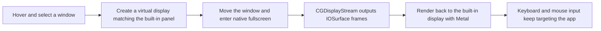

<div align="center">

# MacNotchKiller

**True fullscreen for notched MacBook displays.**

An experimental macOS fullscreen tool for notched MacBooks. It moves the selected app into an isolated virtual display, streams the full composed image back to the built-in panel with low latency, and lets video players, virtual machines, and other fullscreen apps use the pixels beside the notch.

[简体中文](README.zh-CN.md)


</div>


<p align="center"><em>Parallels Desktop fullscreen example: the Windows desktop extends into both sides of the notch instead of being shifted downward.</em></p>

## Why it exists

macOS reserves a safe area around the built-in camera housing. Some video players, virtual machines, and graphics apps still avoid the notch area when entering system fullscreen, leaving the pixels beside the notch unused.

MacNotchKiller does not modify the target app. It creates a virtual display that matches the built-in Retina panel, moves the target window there, asks it to enter native fullscreen, and mirrors the complete virtual display image back onto the built-in screen. This preserves the target app's own fullscreen layout and input behavior while using the notch-side pixels.

## Features

- **Interactive window selection**: hover a window to show a blue outline, then click to select it.
- **Native fullscreen migration**: move the target window to a virtual display and trigger macOS native fullscreen.
- **Retina display matching**: copy the built-in display's logical size, pixel size, scale factor, and refresh rate.
- **Low-latency image pass-through**: receive `IOSurface` frames by display ID and render them with Metal, without video encoding.
- **Normal keyboard and mouse input**: the target app remains frontmost, and regular input continues to be delivered by the system.
- **Input safety layer**: isolate the virtual display boundary, block common Dock reveal paths, and provide a forced-exit shortcut.
- **Local-only operation**: no network requests, account system, telemetry, or screen upload path.

## How it works



The app does not redraw the target application's UI. The window is still owned by the original app and managed by WindowServer; MacNotchKiller only manages the virtual display lifecycle, image pass-through, and input boundaries. See [Architecture](docs/ARCHITECTURE.md) for details.

## Requirements

- A notched Apple Silicon MacBook
- macOS 13 or later
- Swift 5.10 or later when building from source
- Accessibility permission for the terminal or app that runs MacNotchKiller

The primary validation environment is macOS 26.5.1. Other macOS versions may fail because this project depends on private and deprecated display APIs.

## Quick start

```bash
git clone https://github.com/DTW7607/MacNotchKiller.git
cd MacNotchKiller
swift build -c release
.build/release/MacNotchKiller
```

On first launch, allow the terminal or `MacNotchKiller` to control the keyboard and mouse, then restart the app:

```text
System Settings → Privacy & Security → Accessibility
```

## Usage

1. Open the app you want to use in fullscreen and keep its target window visible.
2. Run MacNotchKiller.
3. Move the mouse; selectable windows are highlighted with a blue outline.
4. Click the target window. The confirmation click is intercepted, so it will not activate controls inside the target window.
5. MacNotchKiller creates the virtual display, migrates the window, and shows the complete fullscreen image.

Press `Control + Option + Command + Q` to remove mouse restrictions, destroy the virtual display, and quit MacNotchKiller.

> Regular `Command + Q` is delivered to the target app, not to MacNotchKiller.

## Exit and recovery

If the target app or display service behaves unexpectedly, use:

```text
Control + Option + Command + Q
```

You can also send `Control + C` from the terminal that launched the app. A normal exit stops the display stream, restores the cursor position, and destroys the virtual display.

## Technical implementation

| Layer | Implementation |
| --- | --- |
| Window selection and control | AppKit, Accessibility API, `CGWindowList` |
| Virtual display | Private runtime class `CGVirtualDisplay` |
| Display layout | CoreGraphics Display Configuration |
| Frame capture | `CGDisplayStream`, `IOSurface` |
| Rendering | Metal, `CAMetalLayer` |
| Input protection | HID Event Tap, CoreGraphics cursor APIs |

## Permissions and privacy

- Accessibility permission is used to select and move the target window and to install the global input safety layer.
- All image and input handling stays on the local machine. The codebase contains no network transmission path.
- Whether `CGDisplayStream` triggers macOS screen recording permission or privacy indicators is controlled by WindowServer and TCC policy. The app cannot bypass or hide those system indicators.

## Known limitations

- `CGVirtualDisplay` is an Apple private API. It may break across macOS updates and is not suitable for Mac App Store distribution.
- `CGDisplayStream` is deprecated since macOS 14 and marked obsolete in the macOS 15 SDK. Future macOS versions may remove the runtime symbols entirely.
- macOS may show a system screen-recording indicator in the upper-right corner while the app is running. MacNotchKiller cannot remove it.
- Only one target window and one built-in display are currently handled.
- Some apps do not allow Accessibility API window movement or native fullscreen control.
- Display arrangement, Space switching, and Dock behavior depend on the WindowServer version.
- This project is experimental. Save important work in the target app before use.

## Build and validation

```bash
# Debug build
swift build

# Release build
swift build -c release
```

Before submitting changes, verify that the project builds and that `.build/`, signing material, local configuration, and local logs are not added to version control. See [Contributing](CONTRIBUTING.md).

## Project status

This project validates a technical path based on a virtual display, direct display stream, and input isolation. Reproducible issues, compatibility reports, and implementation improvements are welcome.

This repository does not currently declare an open-source license. Public visibility does not automatically grant permission to copy, modify, or redistribute the code.
