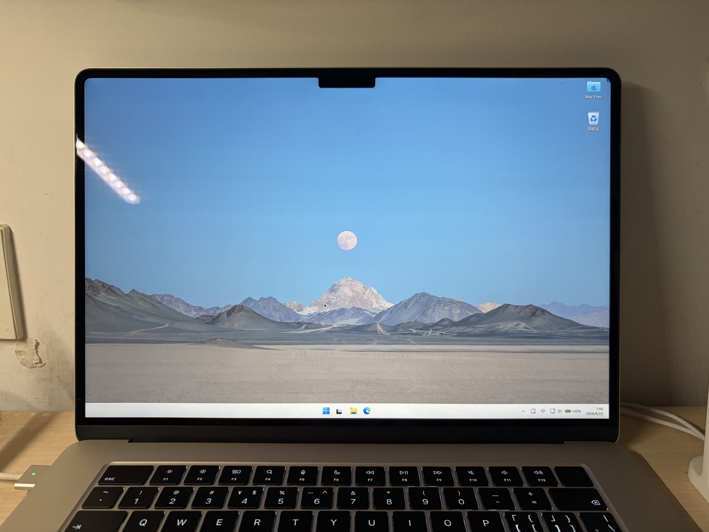

<div align="center">

# FullScreenTools

**让带刘海的 MacBook 真正用满整块屏幕。**

一个面向 macOS 的实验性全屏工具：把选中的应用迁移到隔离虚拟屏，并将完整画面低延迟透传回内置屏幕，让观影、虚拟机和其他全屏应用能够使用刘海两侧区域。


</div>



<p align="center"><em>Parallels Desktop 虚拟机全屏示例：Windows 桌面延伸至刘海两侧，不再整体下移。</em></p>

## 为什么需要它

macOS 会为内置摄像头区域保留安全空间。部分播放器、虚拟机和图形应用进入系统全屏后，内容仍会避开刘海所在的顶部区域，导致两侧像素无法参与显示。

FullScreenTools 不修改目标应用。它创建一个与内置 Retina 屏匹配的虚拟显示器，让目标窗口在虚拟屏上进入原生全屏，再把虚拟屏的完整合成画面显示到内置屏上。这样既保留目标应用原有的全屏布局和键鼠行为，也能使用刘海两侧区域。

## 主要能力

- **主动选择窗口**：鼠标悬停时显示蓝色外框，点击确认目标窗口。
- **原生全屏迁移**：将目标窗口移动到虚拟显示器并触发 macOS 原生全屏。
- **Retina 尺寸匹配**：复制内置屏逻辑尺寸、像素尺寸、缩放比例和刷新率。
- **低延迟画面透传**：按显示器 ID 接收 `IOSurface`，使用 Metal 显示，不经过图像编码。
- **完整键鼠操作**：目标应用保持前台，普通键盘和鼠标输入继续由系统投递。
- **输入安全层**：隔离虚拟屏边界，拦截常见 Dock 唤出路径，并提供强制退出快捷键。
- **本地运行**：没有网络请求、账号系统、遥测或画面上传。

## 工作原理


程序不会把目标应用重新绘制到自己的 UI 中。窗口仍由原应用和 WindowServer 管理；FullScreenTools 只负责虚拟显示器生命周期、画面透传和输入边界保护。详细设计见 [架构说明](docs/ARCHITECTURE.md)。

## 系统要求

- 带刘海的 Apple Silicon MacBook
- macOS 13 或更高版本
- Swift 5.10 或更高版本工具链（从源码构建）
- 为运行程序的终端或应用授予“辅助功能”权限

当前主要验证环境为 macOS 26.5.1。其他系统版本可能因为私有 API 行为变化而无法运行。

## 快速开始

```bash
git clone https://github.com/DTW7607/FullScreenTools.git
cd FullScreenTools
swift build -c release
.build/release/FullScreenTools
```

首次运行时，在以下位置允许终端或 `FullScreenTools` 控制键盘和鼠标，然后重新启动程序：

```text
系统设置 → 隐私与安全性 → 辅助功能
```

## 使用方法

1. 启动需要全屏显示的应用，并保持目标窗口可见。
2. 运行 FullScreenTools。
3. 移动鼠标；可选窗口会出现蓝色外框。
4. 点击目标窗口。确认点击会被拦截，不会误触窗口内控件。
5. 程序创建虚拟屏、迁移窗口并显示完整画面。

按 `Control + Option + Command + Q` 可解除鼠标限制、销毁虚拟屏并退出 FullScreenTools。

> 普通 `Command + Q` 会发送给当前目标应用，而不是退出 FullScreenTools。

## 退出与故障恢复

如果目标应用或显示服务行为异常，优先使用：

```text
Control + Option + Command + Q
```

也可以从启动程序的终端发送 `Control + C`。正常退出会停止画面流、恢复光标位置并销毁虚拟显示器。

## 技术实现

| 层级 | 实现 |
| --- | --- |
| 窗口选择与控制 | AppKit、Accessibility API、`CGWindowList` |
| 虚拟显示器 | 私有运行时类 `CGVirtualDisplay` |
| 显示器布局 | CoreGraphics Display Configuration |
| 画面获取 | `CGDisplayStream`、`IOSurface` |
| 画面显示 | Metal、`CAMetalLayer` |
| 输入保护 | HID Event Tap、CoreGraphics 光标 API |

## 权限与隐私

- 辅助功能权限用于选择、移动目标窗口以及建立全局输入保护层。
- 所有画面和输入都在本机处理，代码中没有网络传输路径。
- `CGDisplayStream` 是否触发系统录屏权限或隐私标识由当前 macOS 的 WindowServer/TCC 策略决定，程序无法绕过或关闭系统提示。

## 已知限制

- `CGVirtualDisplay` 是 Apple 私有 API，可能随 macOS 更新失效，不适合提交 Mac App Store。
- `CGDisplayStream` 从 macOS 14 起弃用，并在 macOS 15 SDK 中标记为 obsolete；未来版本可能彻底移除运行时符号。
- 运行期间屏幕右上角可能出现系统录屏提示，目前无法由应用侧消除。
- 当前仅处理一个目标窗口和一个内置显示器。
- 部分应用不允许 Accessibility API 移动窗口或控制原生全屏。
- 显示器重排、Space 切换和 Dock 行为受 WindowServer 版本影响。
- 项目处于实验阶段，使用前请保存目标应用中的重要工作。

## 构建与验证

```bash
# 调试构建
swift build

# 发布构建
swift build -c release
```

提交代码前请确认构建通过，并且没有把 `.build/`、签名文件、配置文件或本机日志加入版本控制。参见 [贡献指南](CONTRIBUTING.md)。

## 项目状态

当前项目用于验证“虚拟显示器 + 直接显示流 + 输入隔离”这条技术路线。欢迎提交可复现的问题、兼容性结果和改进方案。

本仓库暂未声明开源许可证。公开可见不代表自动授予复制、修改或再分发权限。
